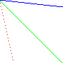
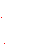
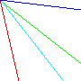
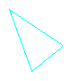
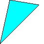
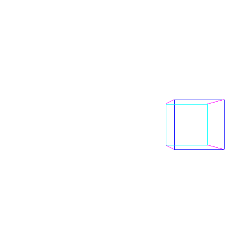
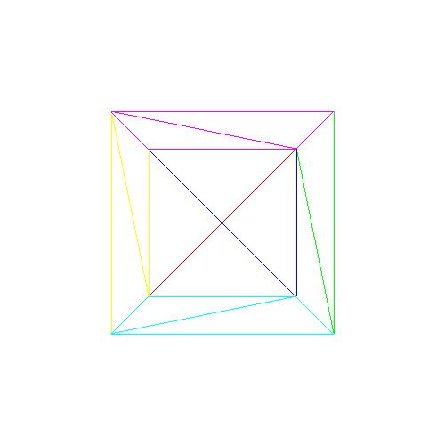
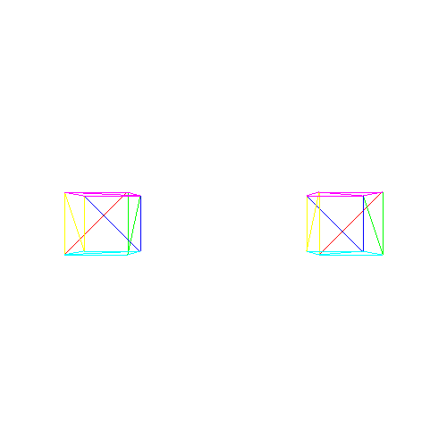
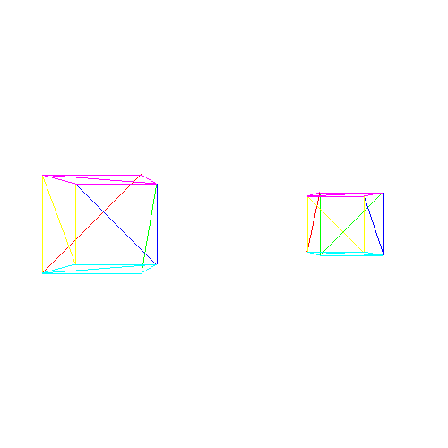
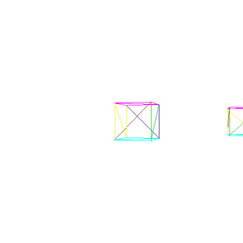

# ma_rasterizer

## What?

Software rasterizer based on [Gabriel Gambetta book](https://www.gabrielgambetta.com/computer-graphics-from-scratch/index.html).

## ROADMAP:

### I. Triangles

    1. class to manipulate with pixel array
    2. draw line
    
Problem with line approximation as y=f(x) ("holed line") as sometimes we need to draw more than one y-pixel for one x pixel (when deal with almost vertical lines):

Solution - for  almost vertical lines use x=f(y) approximation(details in [src/MaRasterizer.cpp](https://github.com/matmuher/ma_rasterizer/blob/main/src/MaRasterizer.cpp) ):

	
	3. draw triangle

    
    3. draw filled triangle

    4. draw shaded triangle
    

 Linear interpolation of shading. Fascinating how much we can do with linear interpolation!

### II. 3D projecting

    1. Convertion functions:
        * From canvas --to--> pixel array
        * From view port --to--> canvas

    [pixel array: real place of pixel]:

        [0,0]---------[1280]>
        |
        |
        |
        \/

    [canvas: to work with pixel array in more natural way, with 4 quadrants]:
    // shifted pixel_array

                ^
                |
                |
        [-640]---------[640]>
                |
                |

    [view port: about scene]
    // scaled canvas

                ^
                |
                |
        [-1.0]---------[1.0]>
                |
                |

    
    2. Project vertex:
        * project vertex from Scene to ViewPort
        * connect vertex on ViewPort to form Scene's proejction

### III. Describe scene [@currently here]

1. Draw model as array of vertexes and triangles:

* Array of 3D points with names (vector is enough)
* Array of triangles (3 points' names)

2. Make instances that that use common model

3. Transform instance (scale + rotate)

4. Transform Camera (rotate + translation)

5. Make transformations homogeneous (check homogeneous coords)

In program we have a series of transformations, to be exact:

* Instance Transformation: every Instance is transformed model it allows us to
    define entity's geometry once and then just reuse it (without redundant vertecis copying for example).

*  Projection: series of projections: scene -> View Port -> canvas -> pixel_array

* And now, when we wanna add Camera moving, we gonna add camera transform
    (briefly, point is movement is relative. so to create effect of transforming camera
    we only need to apply inverse transformation to all objects of scene)

Steps of implementing:

- Add camera transformation matrix (and its update system)
- Transform isntance with matrix
- Concatenate InstanceTransform + CameraTransform + MatrixProjection

### IV. Clipping

Remove from scene objects that are out of camera

### V. Remove hidden surface

Remove surfaces that are behind other surfaces in camera view

### VI. Shading

Let it light?

### VII. Textures

More alive objects

### features

* process files of .obj format
* transfer computing to GPU
* smoothing techniques
* optimization
* profiling
