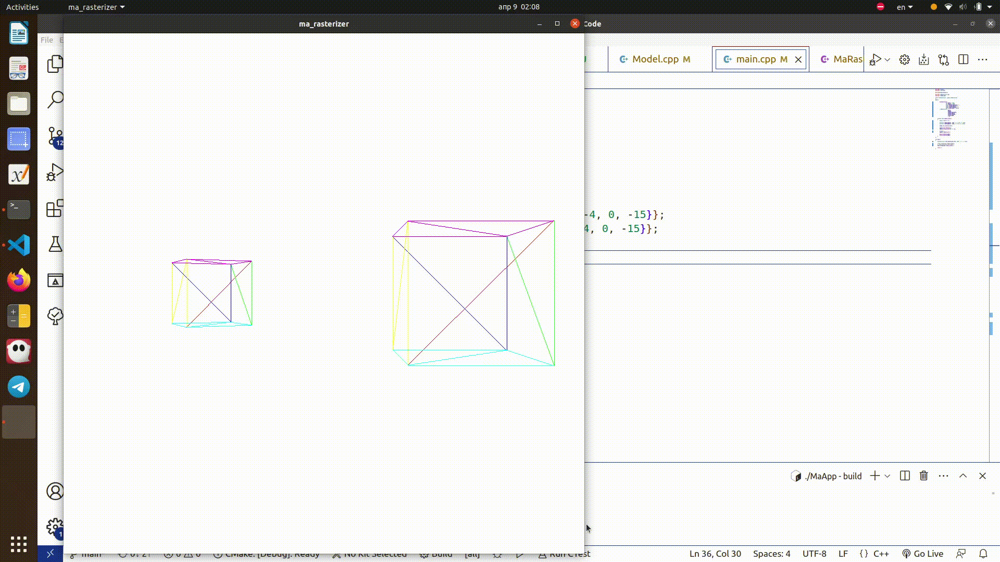

# ma_rasterizer

## What?

Software rasterizer based on [Gabriel Gambetta book](https://www.gabrielgambetta.com/computer-graphics-from-scratch/index.html).

## ROADMAP:

### I. Triangles

    1. class to manipulate with pixel array
    2. draw line
    
Problem with line approximation as y=f(x) ("holed line") as sometimes we need to draw more than one y-pixel for one x pixel (when deal with almost vertical lines):

Solution - for  almost vertical lines use x=f(y) approximation(details in [src/MaRasterizer.cpp](https://github.com/matmuher/ma_rasterizer/blob/main/src/MaRasterizer.cpp) ):

	
	3. draw triangle

    
    3. draw filled triangle

    4. draw shaded triangle
    

 Linear interpolation of shading. Fascinating how much we can do with linear interpolation!

### II. 3D projecting

    1. Convertion functions:
        * From canvas --to--> pixel array
        * From view port --to--> canvas

    [pixel array: real place of pixel]:

        [0,0]---------[1280]>
        |
        |
        |
        \/

    [canvas: to work with pixel array in more natural way, with 4 quadrants]:
    // shifted pixel_array

                ^
                |
                |
        [-640]---------[640]>
                |
                |

    [view port: about scene]
    // scaled canvas

                ^
                |
                |
        [-1.0]---------[1.0]>
                |
                |

    
    2. Project vertex:
        * project vertex from Scene to ViewPort
        * connect vertex on ViewPort to form Scene's proejction

### III. Describe scene

1. Draw model as array of vertexes and triangles:

* Array of 3D points with names (vector is enough)
* Array of triangles (3 points' names)

2. Make instances that that use common model

3. Transform instance (scale + rotate)

4. Transform Camera (rotate + translation)

5. Make transformations homogeneous (check homogeneous coordinates)

In program we have a series of transformations, to be exact:

* Instance Transformation: every Instance is transformed model. It allows us to
    define entity's geometry once and then just reuse it (without redundant vertecis copying).

*  Projection: series of projections: Scene -> View Port -> Canvas -> pixel_array

* Camera movement (As movement is relative, it doesn't matter whether Camera is moving around Cube or Cube is moving around Camera. So to get desired effect we just need to apply inversed camera movement transformation)

*Steps of implementing*:

- Install Eigen lib for linear algebra
- Add various matrices to transform point (scale, rotate, project, translation) 
- Implement Instance transform using matrices
- Implement Camera transform using matrices
- Concatenate Instance Transform + Camera Transform + Projection Transform to completely transform point
- Add matrices updating system (kinda **Observer pattern**)

### IV. Clipping [@currently here]

Remove from scene objects that are out of camera

*Steps of implementation*

1) Add bounding boxes (for simplicity - spheres) to instances
2) Check whether sphere is in view field (with checking there realation to view planes):
    * fully - draw
    * fully not - dont draw
    * partially - check 3)
3) If it is partially - check every triangle.
   Triangles that are crossed by view field border should 
   be divided into triangles, that completely in or
   completely out of view field

### V. Remove hidden surface

Remove surfaces that are behind other surfaces in camera view

### VI. Shading

Let it light?

### VII. Textures

More alive objects

### features

* process files of .obj format
* transfer computing to GPU
* smoothing techniques
* optimization
* profiling
